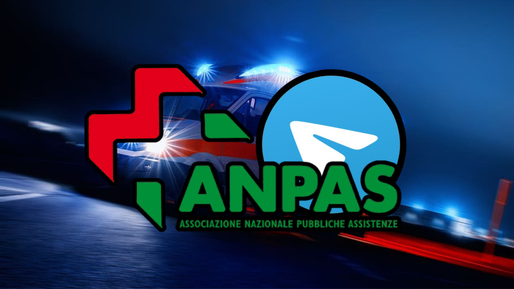

# Pubblica Assistenza Pisa Bot 🤖

A Telegram bot developed to manage the inventory of the Pubblica Assistenza of Pisa, Migliarino section. The bot allows easy tracking and management of inventory items, and generates and stores PDF reports for future reference.

## Features  

- Manage and track inventory items  
- Add, remove, and update inventory data  
- Generate and store PDF reports for the inventory  
- Access and view previous PDF reports  
- Easy-to-use Telegram commands  

## Usage  

Interact with the bot on Telegram to manage the inventory.  
- Add or remove items  
- Generate PDF reports of the current inventory  
- View old PDF reports of previous inventory states  

## License  

This project is open-source and can be modified freely.
